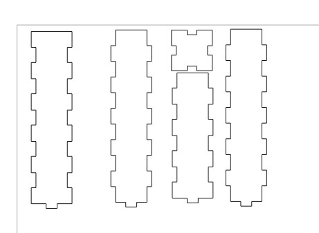
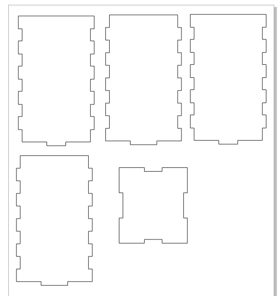
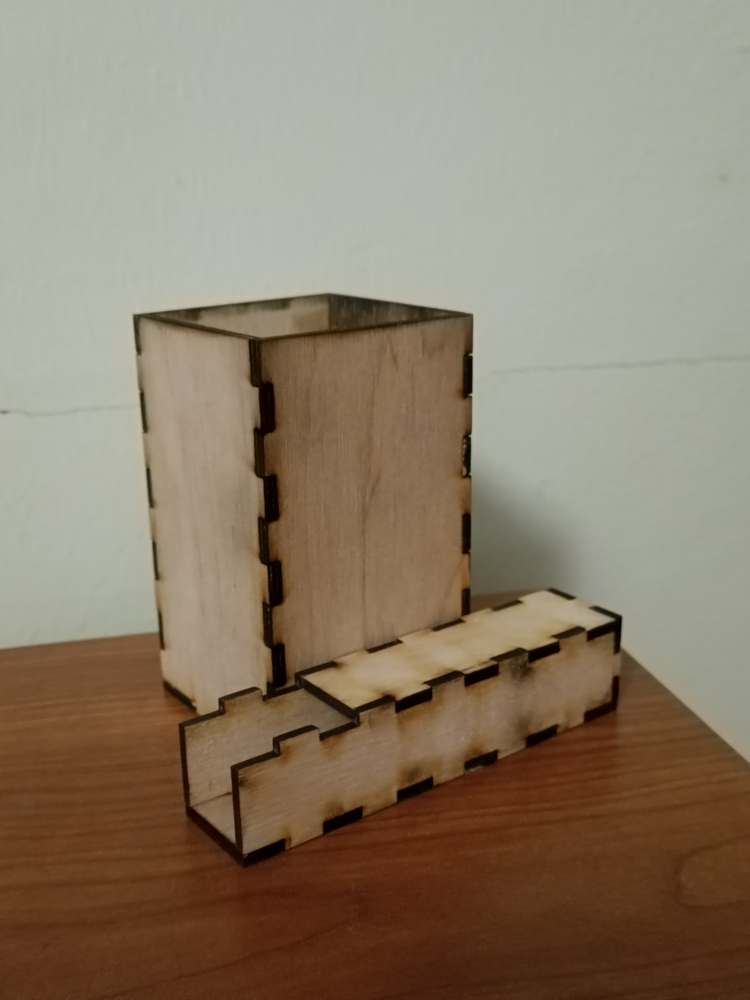
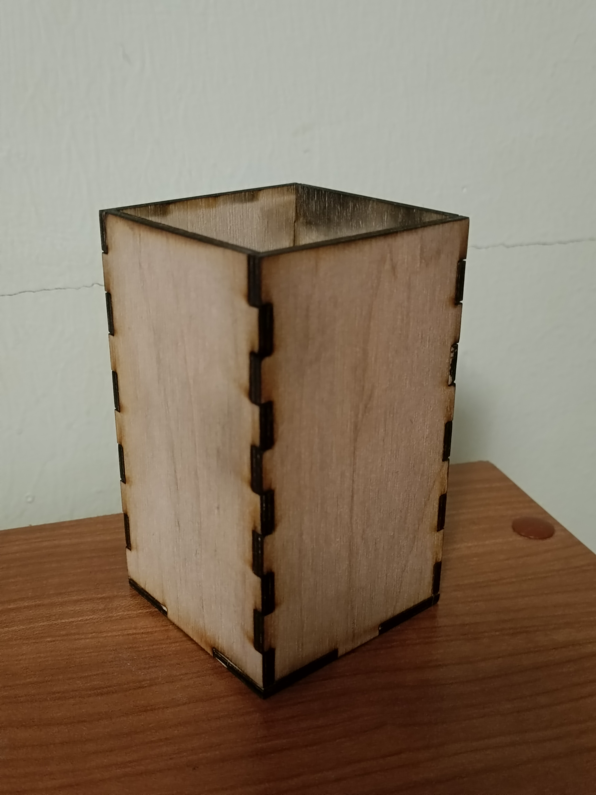
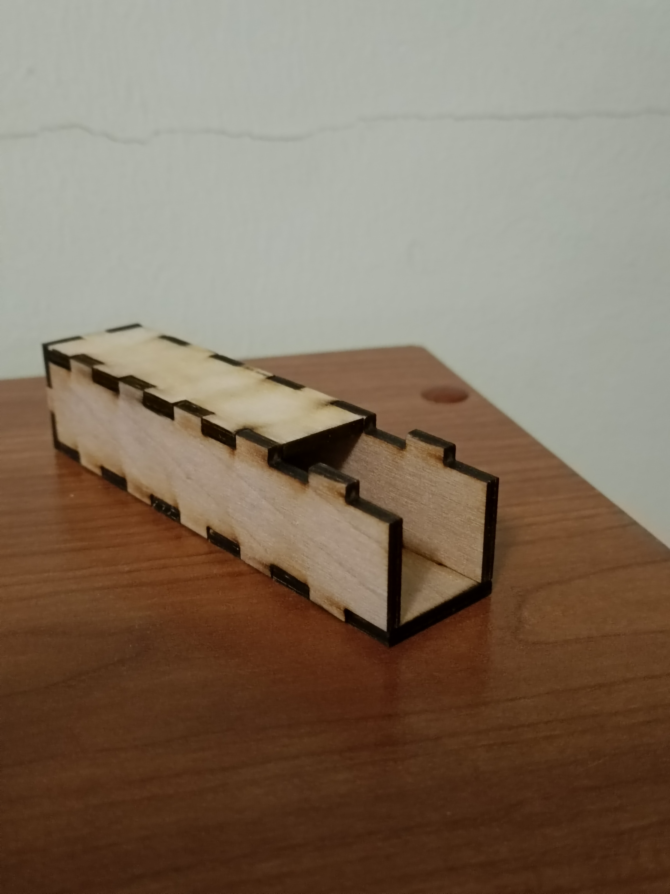

# organizer-for-knives-and-blades
Для выполнения использовались:
1. лист фанеры;
2. лазерный гравер.
## Исследование
Воспользовавшись интернетом былы выяснены средние размеры канцелярских ножей и их лезвий. Размеры самих ножей не сильно нас интересуют, а вот размеры лезвий важны, в среднем они 8 см в длину и 18 мм в ширину.
## Создание
За основу были взяты коробки из фаблаба. Чертежи выглядят следующим образом:

Данные детали вырезались из листа фанеры на лазерном гравере.
## Результат
В итоге получились вот такие две коробочки для ножей и их лезвий:

